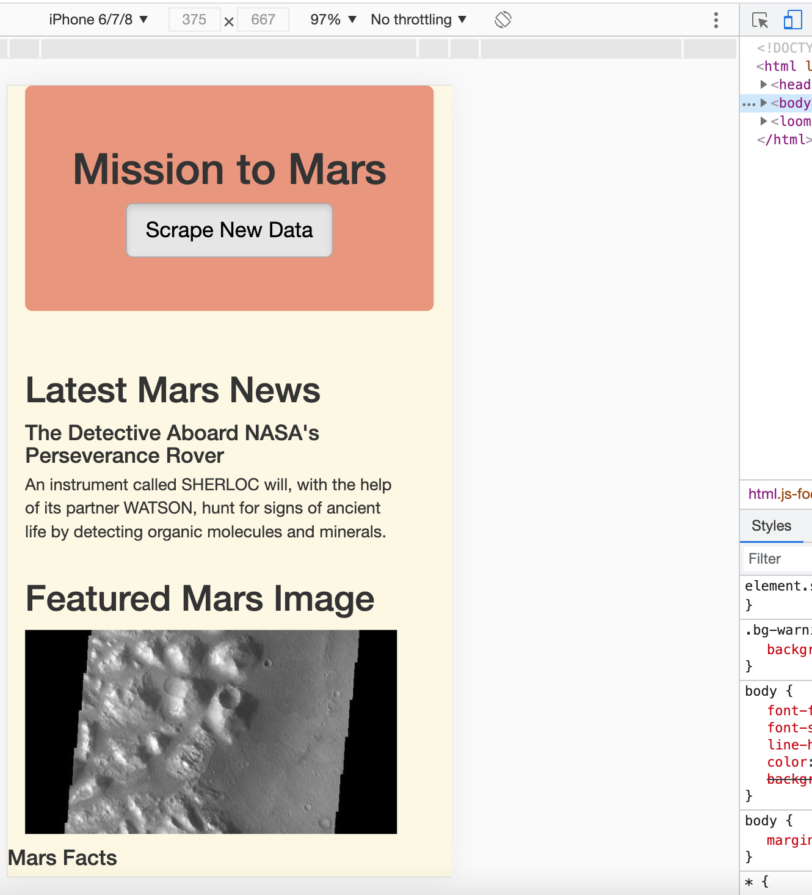

# Mission-to-Mars

## Overview of Project

In this project a junior data scientist, Robin, who does freelance astronomy work wants to gather data on mission to Mars from various websites and display the scraped data in a central location by building a web application that would scrape new data at a click of a button. The gathered data is then stored in a NoSQL database MongoDB since the data that is gathered from the internet is not always in neat forms that SQL requires. To display the data together in a web application, a Python module known as Flask has to be used which is a web framework that allows developing web applications.

### Purpose

The purpose of this project is to add more polish to Robin's current web app by including four Mars hemisphere images and their titles. To do this we are required to use Beautiful Soup which is a Python library used for parsing and extracting data from the desired websites and to use Splinter which is a Python tool used for automating a web browser to scrape full-resolution images and titles of the hemispheres. Additionally, the scraped data has to be stored into a Mongo Database and get displayed on a web application that is going to be built using HTML and CSS. The web page then has to be further altered using Bootsrtap components to make it stand out from other web pages.

## References 

- **Data Sources:** [Mars Nasa News](https://redplanetscience.com/), [Mars Featured Images](https://spaceimages-mars.com), [Mars Facts](https://galaxyfacts-mars.com), [Mars Hemispheres](https://marshemispheres.com/)

- **Additional Sources:** [Bootstrap List](https://getbootstrap.com/docs/3.3/css/)

## Results

This section of the project focuses on the scraped results achieved with the use of BeautifulSoup and Splinter for updating the web application. Additionally, the web app is further updated by making it mobile-responsive and further altering it to make it stand out from other pages by adding Bootsrap components into the **html.index** file.

### Scrape Mars Hemisphere Images and Titles

In this portion of the project BeautifulSoup and Splinter was used for scraping the full-resolution images of Mars's hemispheres and titles of those images. This was done by using the DevTools for inspecting [Mars Hemispheres](https://marshemispheres.com/) website for retrieving the proper elements for data scraping. Furthermore, the common CSS elements for the full-resolution images and titles were found and a for loop was used for iterating through the CSS elements. The image urls and titles were then stored into a dictionary and were then appended to **hemisphere_image_urls** list as depicted in the figure below.

### Updating Web App with Mars's Hemisphere Images and Titles

In this portion of the project, Python along with HTML skills were used for updating the [scraping.py](scraping.py) python file which included all the scripts written to scrape the required data from Mars websites. Additionally, MongoDB database and the **index.html** was modified using the additional scraped data on Mars hemispheres for displaying the full-resolution images and titles of all the four images on the webpage as illustrated in the figure below.

### Adding Boostrap 3 components

Bootstrap which is a **CSS** framework is used for developing responsive and mobile-first websites. This is very useful as Bootstrap consists of designed classes that can be used for adding further styling to elements of a webpage by simply modifying the **index.html** file without writing a code from scratch.

As a result of this, the website was made to be mobile-responsive  in addition to being desktop responsive by updating the grid system classes by adding the col-xs-* (phones) tier of class in addition to the col-md-* (desktop) class in the **index.html** file ensuring that the columns simply don't stack up in mobile devices. Hence, the DevTools was used for inspecting the responsiveness of our website by opening the **Toggle Device Toolbar** and testing the webpage by choosing a mobile device as shown in the figure below. As it can be seen in the image below the data is neatly displayed and viewed in a mobile device.

Additionally, four Bootstrap components were added to the **index.html** file for making the webpage stand out from other pages. Using the added components, the following elements were then further customized:

- The **Scrape New Data** button.
- The **Facts Table**. 
- The **Hemisphere Images** as thumbnails.
- The background of the entire webpage.

Figure below shows the webpage before adding the boostrap components.

The modified webpage after adding the bootsrap components is displayed in the figure below.

## Summary 

In conclusion, this project was completed successfully by gathering the desired scraped data from the Mars hemisphere website. The scraped data was then stored in **mars_app** MongoDB database, which was then connected to the flask app using **flask_pymongo** Python library for displaying the results on the web app. The design of the webpage was then further altered using Bootstrap components.

