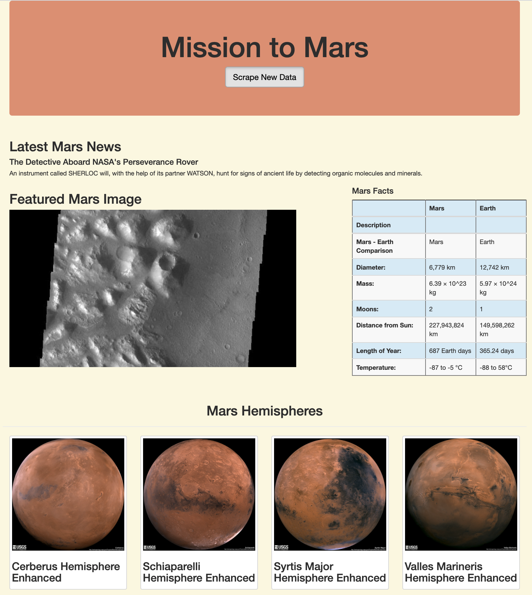

# Mission-to-Mars

## Overview of Project

In this project a junior data scientist, Robin, who does freelance astronomy work wants too gather data about the mission to Mars from various websites and display the scraped data in a central location by building a web application that would scrape new data at a click of a button. The gathered data is then stored in a NoSQL database MongoDB since the data that is gathered from the internet does not always comes in neat forms that SQL requires. To display the data together in a web application, a Python module known as Flask has to be used which is a web framework that allows developing web application.

### Purpose

The purpose of this project is to add to add more polish to Robin's current web app by including four Mars hemisphere images. To do this we are required to use Beautiful Soup which is a Python library used for parsing and extracting data from the desired websites and to use Splinter which is a Python tool used for automating a web browser to scrape full-resolution images of the hemispheres and the titles of those images. Additionally, the scraped data has to be stored into a Mongo Database and finally display the data through the web application using HTML and CSS.

### References 

- Data Sources: [Mars Nasa News](https://redplanetscience.com/), [Mars Featured Images](https://spaceimages-mars.com), [Mars Facts](https://galaxyfacts-mars.com), [Mars Hemispheres](https://marshemispheres.com/)

- Additional Sources: [Bootstrap List](https://getbootstrap.com/docs/3.3/css/)

## Results

This section of the project focuses on the scraped results achieved with the use of BeautifulSoup and Splinter for updating the web application. Additionally, the web app is further updated by making it mobile-responsive and making it stand out from other pages by adding Bootsrap components into the **html.index** file.

### Scrape Mars Hemisphere Images and Titles

In this portion of the project BeautifulSoup and Splinter was used for scraping the full-resolution images of Mars's hemispheres and titles of the images. This was done by using the DevTools for inspecting [Mars Hemispheres](https://marshemispheres.com/) website for retrieving the proper elements to scrape the data. Furthermore, the common CSS element for the full-resolution was found and a for loop was used for iterating through the CSS element. The image urls and titles were then stored in a dictionary and was then appended to **hemisphere_image_urls** list as depicted in the figure below.

### Updating Web App with Mars's Hemisphere Images and Titles

In this portion of the project, Python along with HTML skills were used for updating the scrapying python file which includes all the scripts written to scrape the required data from the websites. Additionally, the Mongo database and the **index.html** was modified using the additional scraped data on Mars hemispheres for displaying the full-resoltuion images and titles of all the four hemisphere images on our web application page as illustarted in the figure below.

### Adding Boostrap 3 components

Bootstrap which is a **CSS** framework is used for developing responsive and mobile-first websites. This is very useful as Bootstrap consists of designed classes that can be used for adding additional styling to web page elements by simply modifying the **index.html** file without writing a code from scratch.

As a result of this, the website was made to be mobile-responsive  in addition to being desktop responsive by updating the grid system classes through the addition of the col-xs-* (phones) tier of class in addition to the col-md-* (desktop) to ensure that the columns simply don't stack up in mobile devices. Hence, the DevTools was used for inspecting the responsiveness of our website by opening the **Toggle Device Toolbar** and testing the wepage by choosing a mobile device as shown in the figure below. As it can be seen in the image below the data is neatly displayed.

Additionally, four Bootstrap components were added to the **index.html** file for making the web page stand out from other pages. using the added components, the following elements were further customized:

- The **Scrape New Data** 
- The **Mission to Mars background**
- The **Facts Table**  
- The **Hemisphere Images** as thumbnails
- The background of the entire page

Figure below shows the web page before adding the boostrap components.

The modified webpage after adding the bootsrap components for modifying the elements is displayed below.

## Summary 

In conclusion, this project was completed succesfully by gathering the desired scraped data from the Mars hemisphere website. The scraped data was then stored in **mars_app** MongoDB NoSQL database, which was then connected to the flask app using **flask_pymongo** Python library for diplaying the results on the web application. The design of the web page was further altered using Bootstrap components.